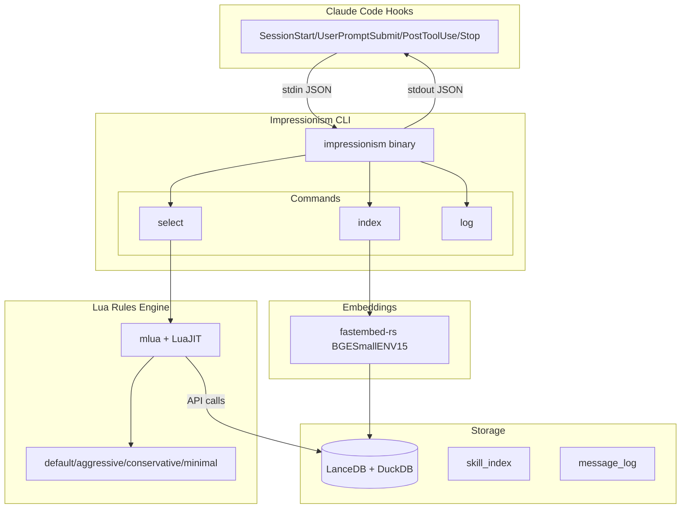

# CLAUDE.md

This file provides guidance to Claude Code (claude.ai/code) when working with code in this repository.

## Project Overview

Impressionism is a Claude Code plugin that dynamically manages skill loading based on conversation context. It consists of:

1. **A Rust CLI utility** (`impressionism`) for skill indexing and selection
2. **A Claude Code plugin** with hooks that invoke the utility at key lifecycle points
3. **A Lua rules engine** that evolves skill activation based on message history

## Build System

This project uses **Bazel with rules_rust**. Cargo.toml exists only for dependency resolution via crate_universe.

```bash
# Build the main binary
bazel build //:impressionism

# Run all tests
bazel test //...

# Run specific test targets
bazel test //tests:integration_tests
bazel test //tests/e2e:e2e_tests  # Requires claude CLI, run with --test_tag_filters=-manual

# Build the plugin package
bazel build //:plugin_package
```

## Architecture



## Key Design Decisions

- **Lightweight skill injection**: Injects skill names/descriptions only (not full content) via `additionalContext` to minimize context window usage
- **Lua rules engine**: Activation logic lives in Lua scripts for rapid iteration without recompilation
- **LanceDB + DuckDB**: Vector storage with SQL queries for hybrid retrieval

## Project Structure

```
src/
├── cli/           # Command implementations (index, select, log)
├── storage/       # LanceDB + DuckDB layer
├── embedding/     # fastembed integration
├── lua/           # Lua VM, API bindings, sandbox
├── config/        # YAML config loading
└── skill/         # Skill parsing and discovery

rules/builtin/     # Built-in Lua rulesets
plugin/            # Claude Code plugin structure (.claude-plugin/, hooks/)
tests/             # Unit, integration, e2e tests
tools/             # Bazel plugin packaging rules
```

## Git Workflow

Use [git-spice](https://abhinav.github.io/git-spice/) for stacked PRs. Branch naming: `imp/<feature>`.

Commit convention: `<type>(<scope>): <description>`
- Types: feat, fix, refactor, test, docs, build, chore
- Scopes: storage, cli, lua, indexing, selection, rules, plugin, e2e

## CLI Commands

```bash
impressionism index [--force]           # Index skills from configured directories
impressionism select --session <id>     # Select skills for current context
impressionism log --session <id>        # Log message to history
impressionism status                    # Show skill index status
impressionism init                      # Initialize configuration
```

## Lua Ruleset API

Rulesets must export `evaluate_activation(context)` and `evaluate_deactivation(context)`. Available API:

```lua
impressionism.get_recent_messages(session_id, count)
impressionism.get_active_skills(session_id)
impressionism.search_skills(query_text, limit)
impressionism.embed_text(text)
impressionism.cosine_similarity(vec_a, vec_b)
impressionism.get_param(name, default)
impressionism.log(level, message)
```
