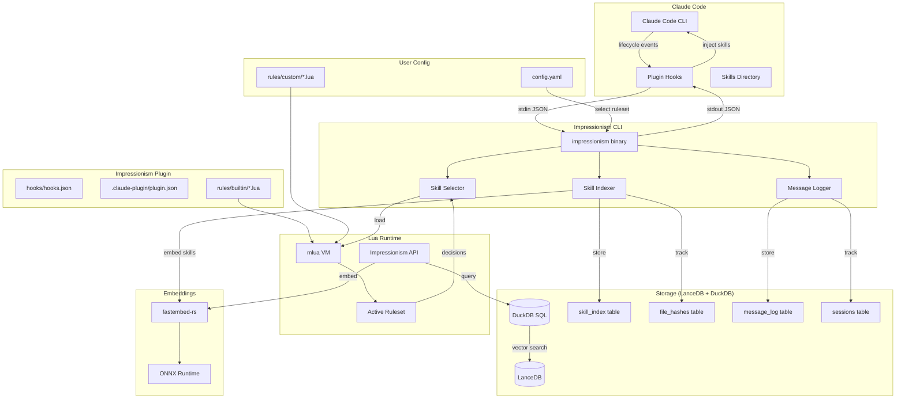
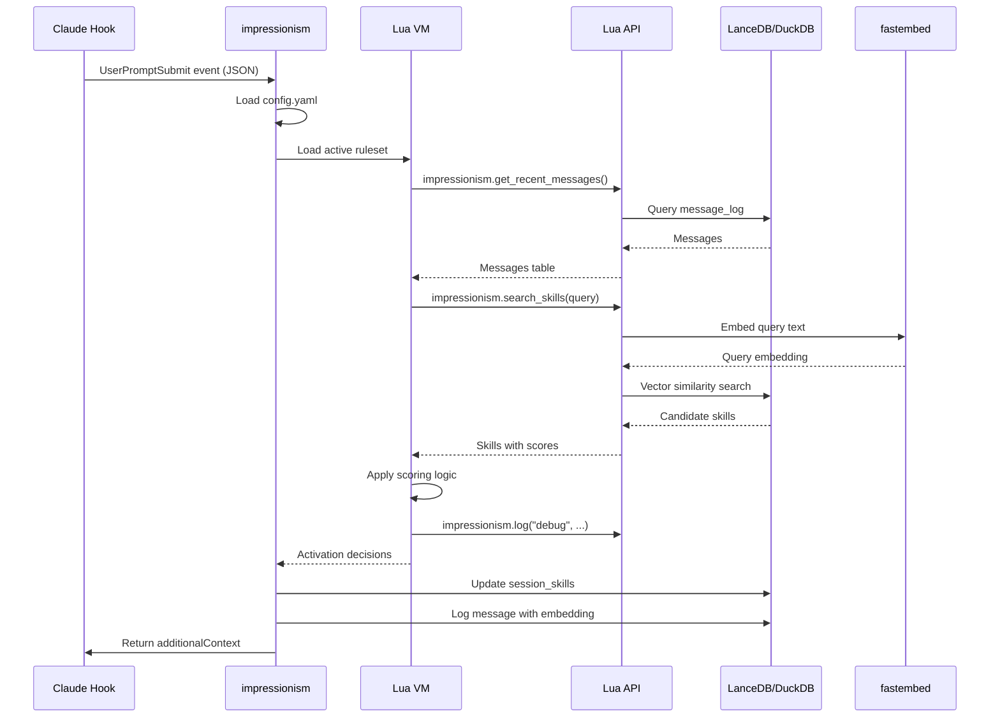
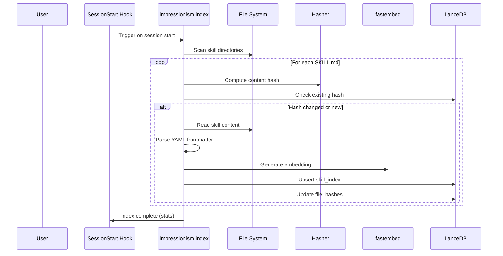
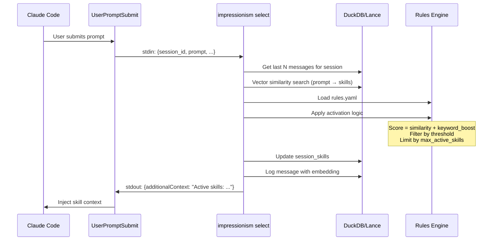
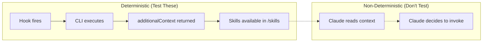

# Epic: Impressionism Base

Baseline implementation of a Claude Code plugin for intelligent skill discovery, indexing, and context-aware activation.

## Overview

**Impressionism** is a Claude Code plugin that dynamically manages skill loading based on conversation context. It consists of:

1. **A Rust CLI utility** (`impressionism`) for skill indexing and selection
2. **A Claude Code plugin** with hooks that invoke the utility at key lifecycle points
3. **A rules engine** that evolves skill activation based on message history

### Goals

- **Efficient skill discovery**: Index skills with file hashing to avoid redundant work
- **Context-aware activation**: Select relevant skills based on recent conversation
- **Graceful deactivation**: Remove skills that are no longer contextually relevant
- **Session awareness**: Track message history per workspace/session
- **Extensibility**: Rules are written in Lua, enabling rapid iteration without recompilation

### Non-Goals (v1)

- Remote skill sources (git repos, marketplaces)
- User-facing summarization (requires external LLM calls)
- Real-time streaming of skill suggestions

---

## Architecture



---

## Components

### 1. Rust CLI (`impressionism`)

The core binary that handles all skill management operations.

#### Commands

```bash
# Index skills from configured directories
impressionism index [--force]

# Select skills for current context (called by hooks)
impressionism select --session <id> --workspace <path>

# Log a message to history (called by hooks)
impressionism log --session <id> --workspace <path> --event <type>

# Show status of skill index
impressionism status

# Initialize configuration
impressionism init
```

#### Hook Integration

The CLI receives JSON on stdin from Claude Code hooks and outputs JSON on stdout.

**Input (from PreToolUse/UserPromptSubmit hook):**
```json
{
  "session_id": "abc123",
  "transcript_path": "/path/to/transcript.json",
  "cwd": "/Users/ed/project",
  "hook_event_name": "UserPromptSubmit",
  "user_prompt": "Help me write a database migration"
}
```

**Output (skill activation):**
```json
{
  "hookSpecificOutput": {
    "hookEventName": "UserPromptSubmit",
    "additionalContext": "Based on your request, these skills may be helpful:\n- /database-migrations - Helpers for creating and managing database migrations\n- /sql-patterns - Common SQL patterns and best practices\n\nUse /skill-name to load a skill's full instructions."
  }
}
```

> **Design Decision: Lightweight Skill Injection**
>
> Impressionism injects skill *names and descriptions* rather than full skill content. This keeps context window usage minimal while still surfacing relevant skills. Claude can then invoke `/skill-name` to load the full skill when needed. This approach trades immediate availability for context efficiency.

### 2. Storage Layer (LanceDB + DuckDB)

Single LanceDB directory storing all data, queryable via DuckDB SQL.

#### Schema

```sql
-- Skill index with embeddings
CREATE TABLE skill_index (
    id VARCHAR PRIMARY KEY,           -- skill path hash
    name VARCHAR NOT NULL,
    path VARCHAR NOT NULL,
    description TEXT,
    embedding FLOAT[384],             -- fastembed dimension
    frontmatter JSON,
    content_hash VARCHAR NOT NULL,
    indexed_at TIMESTAMP NOT NULL,
    source VARCHAR NOT NULL           -- 'user', 'project', 'plugin'
);

-- File hash tracking for incremental indexing
CREATE TABLE file_hashes (
    path VARCHAR PRIMARY KEY,
    content_hash VARCHAR NOT NULL,
    last_checked TIMESTAMP NOT NULL
);

-- Session tracking
CREATE TABLE sessions (
    session_id VARCHAR PRIMARY KEY,
    workspace_path VARCHAR NOT NULL,
    started_at TIMESTAMP NOT NULL,
    last_active TIMESTAMP NOT NULL
);

-- Message log for rule evaluation
CREATE TABLE message_log (
    id INTEGER PRIMARY KEY,
    session_id VARCHAR NOT NULL REFERENCES sessions(session_id),
    sequence INTEGER NOT NULL,        -- message order in session
    role VARCHAR NOT NULL,            -- 'user', 'assistant', 'tool'
    event_type VARCHAR NOT NULL,      -- hook event that captured this
    tool_name VARCHAR,                -- for tool use events
    content_preview TEXT,             -- first N chars of content
    content_embedding FLOAT[384],     -- embedding of full content
    active_skills JSON,               -- skills active at this point
    logged_at TIMESTAMP NOT NULL,

    UNIQUE(session_id, sequence)
);

-- Active skills per session
CREATE TABLE session_skills (
    session_id VARCHAR NOT NULL REFERENCES sessions(session_id),
    skill_id VARCHAR NOT NULL REFERENCES skill_index(id),
    activated_at TIMESTAMP NOT NULL,
    activation_reason TEXT,

    PRIMARY KEY (session_id, skill_id)
);
```

### 3. Embedding Layer (fastembed-rs)

Local embedding generation using ONNX models.

```rust
use fastembed::{TextEmbedding, EmbeddingModel, InitOptions};

pub struct Embedder {
    model: TextEmbedding,
}

impl Embedder {
    pub fn new() -> Result<Self> {
        let model = TextEmbedding::try_new(InitOptions {
            model_name: EmbeddingModel::BGESmallENV15,
            show_download_progress: true,
            ..Default::default()
        })?;
        Ok(Self { model })
    }

    pub fn embed(&self, texts: &[&str]) -> Result<Vec<Vec<f32>>> {
        self.model.embed(texts.to_vec(), None)
    }
}
```

**Model choice**: `BGESmallENV15` (384 dimensions) balances quality and speed for skill matching.

### 4. Rules Engine (Lua)

The rules engine uses embedded Lua for maximum flexibility. Rules are scripts that implement activation and deactivation logic, with access to a rich API for querying skills, messages, and embeddings.

#### Directory Structure

```
~/.config/impressionism/
├── config.yaml                    # Main config, selects active ruleset
└── rules/
    ├── builtin/                   # Ships with impressionism (copied on init)
    │   ├── default.lua            # Default balanced rules
    │   ├── aggressive.lua         # Activate skills eagerly
    │   ├── conservative.lua       # Activate only high-confidence
    │   └── minimal.lua            # Minimal context, fast
    └── custom/                    # User-created rules
        └── (user files here)
```

#### Configuration (`~/.config/impressionism/config.yaml`)

```yaml
# Which ruleset to use (path relative to rules/ directory)
active_ruleset: "builtin/default"

# Global parameters available to all rulesets via impressionism.get_param()
parameters:
  max_active_skills: 5
  embedding_model: "BGESmallENV15"

# Per-ruleset parameter overrides
rulesets:
  builtin/default:
    similarity_threshold: 0.70
    keyword_boost: 0.15
  builtin/aggressive:
    similarity_threshold: 0.50
    keyword_boost: 0.20
  builtin/conservative:
    similarity_threshold: 0.85
    keyword_boost: 0.05

# Indexing configuration (not in Lua - static config)
indexing:
  directories:
    - "~/.claude/skills"
    - ".claude/skills"
  patterns:
    - "**/SKILL.md"
  ignore:
    - "**/node_modules/**"
    - "**/.git/**"

# Tool use logging configuration
logging:
  tool_use: "all"  # "all" | "none" | list of specific tool names
  tool_fields:
    - tool_name
    - tool_input_preview  # First N chars of tool input
  embed_tool_use: false   # Whether to generate embeddings for tool use events
```

#### Lua API

The Rust host exposes an `impressionism` module to Lua scripts:

```lua
-- Query functions
impressionism.get_recent_messages(session_id, count)
    -- Returns: [{role, content, tool_name, embedding, sequence}, ...]

impressionism.get_recent_tool_use(session_id, count)
    -- Returns: [{tool_name, tool_input_preview, logged_at, sequence}, ...]
    -- Filters to only tool use events from message_log

impressionism.get_active_skills(session_id)
    -- Returns: [{id, name, description, path, keywords, embedding, sticky}, ...]

impressionism.get_all_skills()
    -- Returns: [{id, name, description, path, keywords, embedding}, ...]

impressionism.search_skills(query_text, limit)
    -- Returns: [{skill, similarity}, ...] sorted by similarity desc

impressionism.search_skills_by_embedding(embedding, limit)
    -- Returns: [{skill, similarity}, ...] for pre-computed embeddings

-- Embedding functions
impressionism.embed_text(text)
    -- Returns: [f32; 384] embedding vector

impressionism.cosine_similarity(vec_a, vec_b)
    -- Returns: f32 similarity score

-- Configuration functions
impressionism.get_param(name, default)
    -- Returns: parameter value from config.yaml

impressionism.get_session()
    -- Returns: {session_id, workspace_path, started_at}

-- Logging (for debugging rules)
impressionism.log(level, message)
    -- Levels: "debug", "info", "warn", "error"
```

#### Ruleset Interface

Each ruleset must return a table with two functions:

```lua
local M = {}

function M.evaluate_activation(context)
    -- context: {session_id, workspace_path, user_prompt, hook_event}
    -- Returns: [{skill_id, reason}, ...] skills to activate
end

function M.evaluate_deactivation(context)
    -- context: {session_id, workspace_path, hook_event}
    -- Returns: [{skill_id, reason}, ...] skills to deactivate
end

return M
```

#### Built-in Ruleset: `default.lua`

```lua
-- default.lua: Balanced skill activation rules
local M = {}

local function get_config()
    return {
        lookback_activate = impressionism.get_param("lookback_activate", 2),
        lookback_deactivate_start = impressionism.get_param("lookback_deactivate_start", 3),
        lookback_deactivate_end = impressionism.get_param("lookback_deactivate_end", 10),
        similarity_threshold = impressionism.get_param("similarity_threshold", 0.70),
        keyword_boost = impressionism.get_param("keyword_boost", 0.15),
        max_active = impressionism.get_param("max_active_skills", 5),
        inactive_threshold = impressionism.get_param("inactive_threshold", 5),
    }
end

local function has_keyword_match(text, keywords)
    if not keywords then return false end
    local lower_text = text:lower()
    for _, kw in ipairs(keywords) do
        if lower_text:find(kw:lower(), 1, true) then
            return true
        end
    end
    return false
end

function M.evaluate_activation(context)
    local config = get_config()
    local dominated = {}

    -- Get recent messages for context
    local messages = impressionism.get_recent_messages(
        context.session_id,
        config.lookback_activate
    )

    -- Combine recent user messages for search
    local search_text = context.user_prompt or ""
    for _, msg in ipairs(messages) do
        if msg.role == "user" then
            search_text = search_text .. " " .. msg.content
        end
    end

    -- Vector search for relevant skills
    local candidates = impressionism.search_skills(search_text, 20)

    for _, candidate in ipairs(candidates) do
        local score = candidate.similarity

        -- Keyword boost
        if has_keyword_match(search_text, candidate.skill.keywords) then
            score = score + config.keyword_boost
            impressionism.log("debug", string.format(
                "Keyword boost for %s: %.2f -> %.2f",
                candidate.skill.name, candidate.similarity, score
            ))
        end

        if score >= config.similarity_threshold then
            table.insert(dominated, {
                skill = candidate.skill,
                score = score,
                reason = string.format("similarity=%.2f", score)
            })
        end
    end

    -- Sort by score descending
    table.sort(dominated, function(a, b) return a.score > b.score end)

    -- Limit to max and format result
    local result = {}
    for i = 1, math.min(#dominated, config.max_active) do
        table.insert(result, {
            skill_id = dominated[i].skill.id,
            reason = dominated[i].reason
        })
    end

    return result
end

function M.evaluate_deactivation(context)
    local config = get_config()
    local to_deactivate = {}

    local active = impressionism.get_active_skills(context.session_id)
    local messages = impressionism.get_recent_messages(
        context.session_id,
        config.lookback_deactivate_end
    )

    for _, skill in ipairs(active) do
        -- Skip sticky skills
        if skill.sticky then
            goto continue
        end

        -- Count consecutive messages where skill wasn't relevant
        local inactive_count = 0
        for i = config.lookback_deactivate_start, #messages do
            local msg = messages[i]
            if msg.role == "user" and msg.embedding then
                local similarity = impressionism.cosine_similarity(
                    skill.embedding,
                    msg.embedding
                )
                if similarity < config.similarity_threshold * 0.7 then
                    inactive_count = inactive_count + 1
                else
                    inactive_count = 0  -- Reset on relevance
                end
            end
        end

        if inactive_count >= config.inactive_threshold then
            table.insert(to_deactivate, {
                skill_id = skill.id,
                reason = string.format("inactive for %d messages", inactive_count)
            })
        end

        ::continue::
    end

    return to_deactivate
end

return M
```

#### Built-in Ruleset: `aggressive.lua`

```lua
-- aggressive.lua: Eagerly activate skills, slow to deactivate
local default = require("builtin.default")
local M = {}

function M.evaluate_activation(context)
    -- Use lower threshold via config override
    return default.evaluate_activation(context)
end

function M.evaluate_deactivation(context)
    -- More lenient deactivation: require longer inactivity
    local config = {
        inactive_threshold = impressionism.get_param("inactive_threshold", 10),
    }

    -- Deactivate nothing if within threshold
    local active = impressionism.get_active_skills(context.session_id)
    local messages = impressionism.get_recent_messages(context.session_id, 15)

    if #messages < config.inactive_threshold then
        return {}  -- Too early to deactivate anything
    end

    return default.evaluate_deactivation(context)
end

return M
```

#### Example Custom Ruleset

Users can create custom rulesets that extend or replace built-in logic:

```lua
-- custom/my-project.lua: Project-specific rules
local default = require("builtin.default")
local M = {}

function M.evaluate_activation(context)
    local base_result = default.evaluate_activation(context)

    -- Always include project-api skill when in my-project workspace
    if context.workspace_path:find("my%-project") then
        local has_api = false
        for _, s in ipairs(base_result) do
            if s.skill_id:find("project%-api") then
                has_api = true
                break
            end
        end

        if not has_api then
            table.insert(base_result, 1, {
                skill_id = "project-api",
                reason = "project-specific always-on"
            })
        end
    end

    return base_result
end

M.evaluate_deactivation = default.evaluate_deactivation

return M
```

#### Rule Evaluation Flow



#### Lua Sandbox Security

The Lua environment is sandboxed for security:

**Allowed:**
- `impressionism.*` API (all functions)
- `string.*`, `table.*`, `math.*` standard libraries
- `pairs`, `ipairs`, `next`, `type`, `tostring`, `tonumber`
- `require` (only for `builtin.*` and `custom.*` paths)

**Blocked:**
- `os.*` (no system access)
- `io.*` (no file access outside API)
- `loadfile`, `dofile` (no arbitrary code loading)
- `debug.*` (no introspection)
- `rawget`, `rawset`, `setmetatable` on protected tables

### 5. Claude Code Plugin Structure

```
impressionism/
├── .claude-plugin/
│   └── plugin.json
├── hooks/
│   └── hooks.json
├── skills/
│   └── impressionism-help/
│       └── SKILL.md
├── bin/
│   └── impressionism              # Pre-built binary (or build instruction)
├── rules/
│   └── builtin/                   # Bundled Lua rulesets
│       ├── default.lua
│       ├── aggressive.lua
│       ├── conservative.lua
│       └── minimal.lua
├── config/
│   └── config.default.yaml        # Default configuration template
└── README.md
```

#### Plugin Manifest (`.claude-plugin/plugin.json`)

```json
{
  "name": "impressionism",
  "description": "Intelligent skill discovery and context-aware activation",
  "version": "0.1.0",
  "author": {
    "name": "Ed Kohlwey",
    "email": "ed@irl.llc"
  },
  "repository": {
    "type": "git",
    "url": "https://github.com/ed-irl/impressionism"
  },
  "license": "MIT"
}
```

#### Hooks Configuration (`hooks/hooks.json`)

```json
{
  "hooks": {
    "SessionStart": [
      {
        "hooks": [
          {
            "type": "command",
            "command": "${CLAUDE_PLUGIN_ROOT}/bin/impressionism init --if-needed",
            "timeout": 5000
          },
          {
            "type": "command",
            "command": "${CLAUDE_PLUGIN_ROOT}/bin/impressionism index",
            "timeout": 30000
          },
          {
            "type": "command",
            "command": "${CLAUDE_PLUGIN_ROOT}/bin/impressionism select --session $CLAUDE_SESSION_ID --workspace \"$CLAUDE_PROJECT_DIR\"",
            "timeout": 5000
          }
        ]
      }
    ],
    "UserPromptSubmit": [
      {
        "hooks": [
          {
            "type": "command",
            "command": "${CLAUDE_PLUGIN_ROOT}/bin/impressionism index --quick",
            "timeout": 3000
          },
          {
            "type": "command",
            "command": "${CLAUDE_PLUGIN_ROOT}/bin/impressionism log --session $CLAUDE_SESSION_ID --event UserPromptSubmit",
            "timeout": 2000
          },
          {
            "type": "command",
            "command": "${CLAUDE_PLUGIN_ROOT}/bin/impressionism select --session $CLAUDE_SESSION_ID --workspace \"$CLAUDE_PROJECT_DIR\"",
            "timeout": 5000
          }
        ]
      }
    ],
    "PostToolUse": [
      {
        "hooks": [
          {
            "type": "command",
            "command": "${CLAUDE_PLUGIN_ROOT}/bin/impressionism log --session $CLAUDE_SESSION_ID --event PostToolUse",
            "timeout": 2000
          }
        ]
      }
    ],
    "Stop": [
      {
        "hooks": [
          {
            "type": "command",
            "command": "${CLAUDE_PLUGIN_ROOT}/bin/impressionism log --session $CLAUDE_SESSION_ID --event Stop",
            "timeout": 2000
          },
          {
            "type": "command",
            "command": "${CLAUDE_PLUGIN_ROOT}/bin/impressionism select --session $CLAUDE_SESSION_ID --workspace \"$CLAUDE_PROJECT_DIR\" --deactivate-only",
            "timeout": 5000
          }
        ]
      }
    ]
  }
}
```

---

## Data Flow

### Skill Indexing Flow



### Skill Selection Flow



---

## Build System (Bazel + rules_rust)

### Project Structure

```
impressionism/
├── MODULE.bazel
├── BUILD.bazel
├── .bazelrc
├── Cargo.toml                     # For crate_universe dependency resolution
├── Cargo.lock
├── src/
│   ├── BUILD.bazel
│   ├── main.rs
│   ├── lib.rs
│   ├── cli/
│   │   ├── BUILD.bazel
│   │   ├── mod.rs
│   │   ├── index.rs
│   │   ├── select.rs
│   │   └── log.rs
│   ├── storage/
│   │   ├── BUILD.bazel
│   │   ├── mod.rs
│   │   ├── lance.rs
│   │   └── queries.rs
│   ├── embedding/
│   │   ├── BUILD.bazel
│   │   ├── mod.rs
│   │   └── fastembed.rs
│   ├── lua/
│   │   ├── BUILD.bazel
│   │   ├── mod.rs
│   │   ├── engine.rs              # Lua VM setup and execution
│   │   ├── api.rs                 # impressionism.* API bindings
│   │   └── sandbox.rs             # Security sandbox configuration
│   ├── config/
│   │   ├── BUILD.bazel
│   │   ├── mod.rs
│   │   └── loader.rs              # YAML config loading
│   └── skill/
│       ├── BUILD.bazel
│       ├── mod.rs
│       ├── parser.rs
│       └── discovery.rs
├── rules/
│   ├── BUILD.bazel
│   └── builtin/
│       ├── default.lua
│       ├── aggressive.lua
│       ├── conservative.lua
│       └── minimal.lua
├── tests/
│   ├── BUILD.bazel
│   ├── integration/
│   │   ├── BUILD.bazel
│   │   ├── index_test.rs
│   │   ├── select_test.rs
│   │   ├── hook_test.rs
│   │   └── lua_rules_test.rs      # Lua ruleset tests
│   ├── lua/
│   │   ├── BUILD.bazel
│   │   └── test_rulesets.lua      # Lua-side rule testing
│   ├── e2e/
│   │   ├── BUILD.bazel
│   │   ├── requirements_lock.txt  # pytest, etc.
│   │   ├── conftest.py            # Shared fixtures
│   │   ├── test_skill_injection.py
│   │   ├── test_skill_invocation.py
│   │   ├── test_plugin_discovery.py
│   │   └── test_project/
│   │       ├── .claude/
│   │       │   └── settings.json
│   │       └── README.md
│   └── fixtures/
│       ├── skills/
│       └── rules/                 # Test rulesets
├── plugin/
│   ├── BUILD.bazel
│   ├── .claude-plugin/
│   │   └── plugin.json
│   ├── hooks/
│   │   └── hooks.json
│   ├── skills/
│   │   └── impressionism-help/
│   │       └── SKILL.md
│   └── config/
│       └── config.default.yaml
└── tools/
    ├── BUILD.bazel
    ├── plugin.bzl                 # Claude plugin packaging rule
    └── plugin_packager.rs         # Cross-platform packager binary
```

### MODULE.bazel

```python
module(
    name = "impressionism",
    version = "0.1.0",
)

bazel_dep(name = "rules_rust", version = "0.68.1")
bazel_dep(name = "rules_python", version = "1.1.0")

rust = use_extension("@rules_rust//rust:extensions.bzl", "rust")
rust.toolchain(
    edition = "2021",
    versions = ["1.83.0"],
)

crate = use_extension("@rules_rust//crate_universe:extension.bzl", "crate")
crate.from_cargo(
    name = "crates",
    cargo_lockfile = "//:Cargo.lock",
    manifests = ["//:Cargo.toml"],
)
use_repo(crate, "crates")

# Python for e2e tests
pip = use_extension("@rules_python//python/extensions:pip.bzl", "pip")
pip.parse(
    hub_name = "pip",
    python_version = "3.11",
    requirements_lock = "//tests/e2e:requirements_lock.txt",
)
use_repo(pip, "pip")
```

### Root BUILD.bazel

```python
load("@rules_rust//rust:defs.bzl", "rust_binary", "rust_library", "rust_test")

rust_binary(
    name = "impressionism",
    srcs = ["src/main.rs"],
    deps = [
        ":impressionism_lib",
        "@crates//:clap",
        "@crates//:anyhow",
    ],
    visibility = ["//visibility:public"],
)

rust_library(
    name = "impressionism_lib",
    srcs = glob(["src/**/*.rs"], exclude = ["src/main.rs"]),
    deps = [
        "@crates//:lancedb",
        "@crates//:duckdb",
        "@crates//:fastembed",
        "@crates//:mlua",
        "@crates//:serde",
        "@crates//:serde_yaml",
        "@crates//:serde_json",
        "@crates//:tokio",
        "@crates//:anyhow",
        "@crates//:thiserror",
        "@crates//:sha2",
        "@crates//:walkdir",
        "@crates//:glob",
    ],
    # Embed builtin Lua rules as compile-time assets
    compile_data = ["//rules:builtin_rules"],
    visibility = ["//visibility:public"],
)

# Plugin packaging
load("//tools:plugin.bzl", "claude_plugin")

claude_plugin(
    name = "plugin_package",
    binary = ":impressionism",
    plugin_name = "impressionism",
    plugin_manifest = "//plugin:.claude-plugin/plugin.json",
    hooks = "//plugin:hooks",
    skills = "//plugin:skills",
    config = "//plugin:config",
    rules = "//rules:builtin_rules",
)
```

### tools/plugin.bzl

Custom Bazel rule for packaging Claude Code plugins:

```python
"""Rules for building Claude Code plugins."""

def _claude_plugin_impl(ctx):
    """Implementation of claude_plugin rule."""
    output = ctx.actions.declare_file(ctx.attr.plugin_name + "-plugin.tar.gz")

    # Collect all input files
    inputs = []
    inputs.append(ctx.file.binary)
    inputs.append(ctx.file.plugin_manifest)
    inputs.extend(ctx.files.hooks)
    inputs.extend(ctx.files.skills)
    inputs.extend(ctx.files.config)
    inputs.extend(ctx.files.rules)

    # Build the directory structure manifest
    plugin_name = ctx.attr.plugin_name

    # Create args file for the packaging script
    args = ctx.actions.args()
    args.add("--output", output)
    args.add("--plugin-name", plugin_name)
    args.add("--binary", ctx.file.binary)
    args.add("--manifest", ctx.file.plugin_manifest)
    args.add_all("--hooks", ctx.files.hooks)
    args.add_all("--skills", ctx.files.skills)
    args.add_all("--config", ctx.files.config)
    args.add_all("--rules", ctx.files.rules)

    ctx.actions.run(
        outputs = [output],
        inputs = inputs,
        executable = ctx.executable._packager,
        arguments = [args],
        mnemonic = "ClaudePluginPackage",
        progress_message = "Packaging Claude plugin %s" % plugin_name,
    )

    return [
        DefaultInfo(
            files = depset([output]),
            runfiles = ctx.runfiles(files = [output]),
        ),
    ]

claude_plugin = rule(
    implementation = _claude_plugin_impl,
    attrs = {
        "plugin_name": attr.string(
            mandatory = True,
            doc = "Name of the plugin (used for output filename and directory)",
        ),
        "binary": attr.label(
            mandatory = True,
            allow_single_file = True,
            doc = "The main plugin binary",
        ),
        "plugin_manifest": attr.label(
            mandatory = True,
            allow_single_file = [".json"],
            doc = "The .claude-plugin/plugin.json manifest file",
        ),
        "hooks": attr.label(
            allow_files = True,
            doc = "Hook configuration files (hooks/)",
        ),
        "skills": attr.label(
            allow_files = True,
            doc = "Skill files (skills/)",
        ),
        "config": attr.label(
            allow_files = True,
            doc = "Configuration template files (config/)",
        ),
        "rules": attr.label(
            allow_files = [".lua"],
            doc = "Lua ruleset files",
        ),
        "_packager": attr.label(
            default = "//tools:plugin_packager",
            executable = True,
            cfg = "exec",
            doc = "The packaging tool",
        ),
    },
    doc = "Packages a Claude Code plugin into a distributable tarball.",
)
```

### tools/plugin_packager.rs

Rust tool for reliable cross-platform plugin packaging:

```rust
//! Plugin packager for Claude Code plugins.
//!
//! Creates a properly structured tarball from plugin components.

use anyhow::{Context, Result};
use clap::Parser;
use std::fs::{self, File};
use std::path::{Path, PathBuf};
use flate2::write::GzEncoder;
use flate2::Compression;
use tar::Builder;

#[derive(Parser)]
struct Args {
    #[arg(long)]
    output: PathBuf,

    #[arg(long)]
    plugin_name: String,

    #[arg(long)]
    binary: PathBuf,

    #[arg(long)]
    manifest: PathBuf,

    #[arg(long)]
    hooks: Vec<PathBuf>,

    #[arg(long)]
    skills: Vec<PathBuf>,

    #[arg(long)]
    config: Vec<PathBuf>,

    #[arg(long)]
    rules: Vec<PathBuf>,
}

fn main() -> Result<()> {
    let args = Args::parse();
    let plugin_dir = &args.plugin_name;

    let file = File::create(&args.output)
        .context("Failed to create output file")?;
    let enc = GzEncoder::new(file, Compression::default());
    let mut tar = Builder::new(enc);

    // Add binary
    add_file(&mut tar, &args.binary, &format!("{}/bin/impressionism", plugin_dir))?;

    // Add manifest
    add_file(&mut tar, &args.manifest, &format!("{}/.claude-plugin/plugin.json", plugin_dir))?;

    // Add hooks (preserve relative structure)
    add_files_with_prefix(&mut tar, &args.hooks, plugin_dir, "hooks")?;

    // Add skills (preserve relative structure)
    add_files_with_prefix(&mut tar, &args.skills, plugin_dir, "skills")?;

    // Add config
    add_files_with_prefix(&mut tar, &args.config, plugin_dir, "config")?;

    // Add Lua rules
    add_files_with_prefix(&mut tar, &args.rules, plugin_dir, "rules/builtin")?;

    tar.finish()?;
    Ok(())
}

fn add_file<W: std::io::Write>(
    tar: &mut Builder<W>,
    src: &Path,
    dest: &str,
) -> Result<()> {
    let mut file = File::open(src)
        .with_context(|| format!("Failed to open {}", src.display()))?;
    tar.append_file(dest, &mut file)
        .with_context(|| format!("Failed to add {} to archive", dest))?;
    Ok(())
}

fn add_files_with_prefix<W: std::io::Write>(
    tar: &mut Builder<W>,
    files: &[PathBuf],
    plugin_dir: &str,
    subdir: &str,
) -> Result<()> {
    for file in files {
        let filename = file.file_name()
            .context("Invalid filename")?
            .to_string_lossy();
        let dest = format!("{}/{}/{}", plugin_dir, subdir, filename);
        add_file(tar, file, &dest)?;
    }
    Ok(())
}
```

### tools/BUILD.bazel

```python
load("@rules_rust//rust:defs.bzl", "rust_binary")

rust_binary(
    name = "plugin_packager",
    srcs = ["plugin_packager.rs"],
    deps = [
        "@crates//:anyhow",
        "@crates//:clap",
        "@crates//:flate2",
        "@crates//:tar",
    ],
    visibility = ["//visibility:public"],
)
```

### rules/BUILD.bazel

```python
# Lua ruleset files
filegroup(
    name = "builtin_rules",
    srcs = glob(["builtin/**/*.lua"]),
    visibility = ["//visibility:public"],
)

# For testing custom rules
filegroup(
    name = "test_rules",
    srcs = glob(["test/**/*.lua"]),
    visibility = ["//tests:__subpackages__"],
)
```

### plugin/BUILD.bazel

```python
filegroup(
    name = "hooks",
    srcs = glob(["hooks/**"]),
    visibility = ["//visibility:public"],
)

filegroup(
    name = "skills",
    srcs = glob(["skills/**"]),
    visibility = ["//visibility:public"],
)

filegroup(
    name = "config",
    srcs = glob(["config/**"]),
    visibility = ["//visibility:public"],
)
```

### Cargo.toml (for crate_universe)

```toml
[package]
name = "impressionism"
version = "0.1.0"
edition = "2021"

[dependencies]
# CLI
clap = { version = "4.5", features = ["derive"] }
anyhow = "1.0"
thiserror = "1.0"

# Storage
lancedb = "0.15"
duckdb = { version = "1.1", features = ["bundled"] }
arrow = "53"

# Embedding
fastembed = "4"

# Lua scripting
mlua = { version = "0.10", features = ["luajit", "serialize", "send"] }

# Serialization
serde = { version = "1.0", features = ["derive"] }
serde_yaml = "0.9"
serde_json = "1.0"

# Async
tokio = { version = "1", features = ["full"] }

# Utilities
sha2 = "0.10"
walkdir = "2"
glob = "0.3"
chrono = { version = "0.4", features = ["serde"] }
directories = "5"

# Packaging (used by tools/plugin_packager)
flate2 = "1.0"
tar = "0.4"

[dev-dependencies]
assert_cmd = "2.0"
predicates = "3.1"
assert_fs = "1.1"
tempfile = "3"
```

---

## Testing Strategy

### Unit Tests

Each module has unit tests for isolated logic:

```rust
// src/lua/engine.rs
#[cfg(test)]
mod tests {
    use super::*;

    #[test]
    fn test_lua_sandbox_blocks_os() {
        let engine = LuaEngine::new_sandboxed().unwrap();
        let result = engine.eval("os.execute('ls')");
        assert!(result.is_err());
        assert!(result.unwrap_err().to_string().contains("nil"));
    }

    #[test]
    fn test_lua_sandbox_allows_string() {
        let engine = LuaEngine::new_sandboxed().unwrap();
        let result: String = engine.eval("string.upper('hello')").unwrap();
        assert_eq!(result, "HELLO");
    }

    #[test]
    fn test_lua_api_get_param() {
        let engine = LuaEngine::new_sandboxed().unwrap();
        engine.set_params(&[("threshold", 0.7)]);

        let result: f64 = engine.eval(r#"
            impressionism.get_param("threshold", 0.5)
        "#).unwrap();

        assert_eq!(result, 0.7);
    }

    #[test]
    fn test_lua_api_get_param_default() {
        let engine = LuaEngine::new_sandboxed().unwrap();

        let result: f64 = engine.eval(r#"
            impressionism.get_param("missing", 0.5)
        "#).unwrap();

        assert_eq!(result, 0.5);
    }
}
```

### Lua Ruleset Tests

Test rulesets directly using a mock API:

```rust
// tests/integration/lua_rules_test.rs
use impressionism_lib::lua::{LuaEngine, MockApi};

#[test]
fn test_default_ruleset_activation() {
    let engine = LuaEngine::new_sandboxed().unwrap();

    // Set up mock data
    let mock = MockApi::new()
        .with_skills(vec![
            skill("db-migrations", "Database migration helpers", &["migration", "schema"]),
            skill("testing", "Testing utilities", &["test", "mock"]),
        ])
        .with_messages(vec![
            message("user", "Help me write a database migration"),
        ])
        .with_search_results(vec![
            ("db-migrations", 0.85),
            ("testing", 0.45),
        ]);

    engine.register_api(mock);
    engine.load_ruleset("builtin/default").unwrap();

    let context = json!({
        "session_id": "test",
        "workspace_path": "/test",
        "user_prompt": "Help me write a database migration",
    });

    let result = engine.call_activation(&context).unwrap();

    assert_eq!(result.len(), 1);
    assert_eq!(result[0].skill_id, "db-migrations");
    assert!(result[0].reason.contains("similarity"));
}

#[test]
fn test_default_ruleset_keyword_boost() {
    let engine = LuaEngine::new_sandboxed().unwrap();

    let mock = MockApi::new()
        .with_skills(vec![
            skill("db-migrations", "Database migration helpers", &["migration"]),
        ])
        .with_search_results(vec![
            ("db-migrations", 0.65),  // Below threshold without boost
        ]);

    engine.register_api(mock);
    engine.set_params(&[
        ("similarity_threshold", 0.70),
        ("keyword_boost", 0.15),
    ]);
    engine.load_ruleset("builtin/default").unwrap();

    let context = json!({
        "session_id": "test",
        "workspace_path": "/test",
        "user_prompt": "Create a migration for users table",  // Contains "migration"
    });

    let result = engine.call_activation(&context).unwrap();

    // Should activate because 0.65 + 0.15 = 0.80 > 0.70
    assert_eq!(result.len(), 1);
}

#[test]
fn test_default_ruleset_deactivation() {
    let engine = LuaEngine::new_sandboxed().unwrap();

    let mock = MockApi::new()
        .with_active_skills(vec![
            skill("db-migrations", "Database migration helpers", &[]),
        ])
        .with_messages(vec![
            // 6 messages not about migrations
            message("user", "How do I write a test?"),
            message("user", "What about mocking?"),
            message("user", "Can you explain assertions?"),
            message("user", "How do I run tests?"),
            message("user", "What's test coverage?"),
            message("user", "Any testing best practices?"),
        ]);

    engine.register_api(mock);
    engine.set_params(&[("inactive_threshold", 5)]);
    engine.load_ruleset("builtin/default").unwrap();

    let context = json!({
        "session_id": "test",
        "workspace_path": "/test",
    });

    let result = engine.call_deactivation(&context).unwrap();

    assert_eq!(result.len(), 1);
    assert_eq!(result[0].skill_id, "db-migrations");
}
```

### Custom Ruleset Validation

Test that custom rulesets are valid:

```rust
// tests/integration/lua_rules_test.rs

#[test]
fn test_custom_ruleset_must_have_activation() {
    let engine = LuaEngine::new_sandboxed().unwrap();

    let bad_ruleset = r#"
        local M = {}
        -- Missing evaluate_activation
        function M.evaluate_deactivation(context)
            return {}
        end
        return M
    "#;

    let result = engine.load_ruleset_from_string(bad_ruleset);
    assert!(result.is_err());
    assert!(result.unwrap_err().to_string().contains("evaluate_activation"));
}

#[test]
fn test_custom_ruleset_must_return_table() {
    let engine = LuaEngine::new_sandboxed().unwrap();

    let bad_ruleset = r#"
        return "not a table"
    "#;

    let result = engine.load_ruleset_from_string(bad_ruleset);
    assert!(result.is_err());
}
```

### Integration Tests

End-to-end tests using `assert_cmd`:

```rust
// tests/integration/index_test.rs
use assert_cmd::Command;
use assert_fs::prelude::*;
use predicates::prelude::*;

#[test]
fn test_index_discovers_skills() {
    // Create temp directory with test skills
    let temp = assert_fs::TempDir::new().unwrap();
    let skills_dir = temp.child(".claude/skills/test-skill");
    skills_dir.create_dir_all().unwrap();

    skills_dir.child("SKILL.md").write_str(r#"---
name: test-skill
description: A test skill for integration testing
---
# Test Skill
This is a test skill.
"#).unwrap();

    // Run indexer
    let mut cmd = Command::cargo_bin("impressionism").unwrap();
    cmd.arg("index")
        .arg("--config-dir")
        .arg(temp.path())
        .env("IMPRESSIONISM_SKILLS_DIR", skills_dir.path());

    cmd.assert()
        .success()
        .stdout(predicate::str::contains("Indexed 1 skill"));
}

#[test]
fn test_select_returns_relevant_skills() {
    // Setup: index skills, create session
    let temp = setup_test_environment();

    // Simulate hook input
    let input = serde_json::json!({
        "session_id": "test-session",
        "cwd": temp.path(),
        "user_prompt": "Help me write a database migration"
    });

    let mut cmd = Command::cargo_bin("impressionism").unwrap();
    cmd.arg("select")
        .arg("--session")
        .arg("test-session")
        .arg("--workspace")
        .arg(temp.path())
        .write_stdin(input.to_string());

    cmd.assert()
        .success()
        .stdout(predicate::str::contains("database-migrations"));
}
```

### Hook Simulation Tests

Test the full hook → CLI → response flow by simulating Claude Code hook payloads:

```rust
// tests/integration/hook_test.rs

/// Test fixture that sets up a complete hook simulation environment
struct HookTestHarness {
    temp_dir: TempDir,
    session_id: String,
    workspace: PathBuf,
}

impl HookTestHarness {
    fn new() -> Self {
        let temp_dir = TempDir::new().unwrap();
        let workspace = temp_dir.path().to_path_buf();
        Self {
            temp_dir,
            session_id: format!("test-{}", uuid::Uuid::new_v4()),
            workspace,
        }
    }

    /// Simulates the SessionStart hook sequence
    fn simulate_session_start(&self) -> Result<()> {
        // 1. init --if-needed
        self.run_command(&["init", "--if-needed"])?;

        // 2. index
        self.run_command(&["index"])?;

        // 3. select
        self.run_select(None)
    }

    /// Simulates the UserPromptSubmit hook sequence
    fn simulate_user_prompt(&self, prompt: &str) -> Result<SelectOutput> {
        let input = serde_json::json!({
            "session_id": self.session_id,
            "cwd": self.workspace,
            "hook_event_name": "UserPromptSubmit",
            "user_prompt": prompt
        });

        // 1. index --quick
        self.run_command(&["index", "--quick"])?;

        // 2. log event
        self.run_command_with_stdin(
            &["log", "--session", &self.session_id, "--event", "UserPromptSubmit"],
            &input.to_string()
        )?;

        // 3. select (returns skill suggestions)
        self.run_select(Some(prompt))
    }

    /// Simulates the PostToolUse hook
    fn simulate_tool_use(&self, tool_name: &str, tool_input: &str) -> Result<()> {
        let input = serde_json::json!({
            "session_id": self.session_id,
            "hook_event_name": "PostToolUse",
            "tool_name": tool_name,
            "tool_input": tool_input
        });

        self.run_command_with_stdin(
            &["log", "--session", &self.session_id, "--event", "PostToolUse"],
            &input.to_string()
        )
    }

    /// Simulates the Stop hook sequence
    fn simulate_stop(&self) -> Result<()> {
        let input = serde_json::json!({
            "session_id": self.session_id,
            "hook_event_name": "Stop"
        });

        // 1. log event
        self.run_command_with_stdin(
            &["log", "--session", &self.session_id, "--event", "Stop"],
            &input.to_string()
        )?;

        // 2. deactivate-only
        self.run_command(&[
            "select", "--session", &self.session_id,
            "--workspace", self.workspace.to_str().unwrap(),
            "--deactivate-only"
        ])
    }
}

#[test]
fn test_full_session_lifecycle() {
    let harness = HookTestHarness::new();
    harness.setup_test_skills(&["database", "testing", "api"]);

    // SessionStart
    harness.simulate_session_start().unwrap();

    // User asks about databases - should suggest database skill
    let result = harness.simulate_user_prompt("Help me write a database migration").unwrap();
    assert!(result.suggested_skills.iter().any(|s| s.contains("database")));

    // Tool use is logged
    harness.simulate_tool_use("Edit", r#"{"file": "migrations/001.sql"}"#).unwrap();

    // User switches topics - database skill should eventually deactivate
    for _ in 0..6 {
        harness.simulate_user_prompt("How do I write unit tests?").unwrap();
    }

    // Stop session
    harness.simulate_stop().unwrap();
}

#[test]
fn test_quick_index_detects_new_skills() {
    let harness = HookTestHarness::new();

    // Start session with no skills
    harness.simulate_session_start().unwrap();

    // Add a skill mid-session
    harness.add_skill("new-skill", "A skill added during the session");

    // Quick index should pick it up
    harness.simulate_user_prompt("Help with the new skill").unwrap();

    // Verify skill was indexed
    let skills = harness.get_indexed_skills();
    assert!(skills.iter().any(|s| s.name == "new-skill"));
}

#[test]
fn test_tool_use_logging() {
    let harness = HookTestHarness::new();
    harness.simulate_session_start().unwrap();

    // Simulate several tool uses
    harness.simulate_tool_use("Read", r#"{"file": "src/main.rs"}"#).unwrap();
    harness.simulate_tool_use("Edit", r#"{"file": "src/main.rs"}"#).unwrap();
    harness.simulate_tool_use("Bash", r#"{"command": "cargo build"}"#).unwrap();

    // Verify tool use was logged
    let tool_log = harness.get_tool_use_log();
    assert_eq!(tool_log.len(), 3);
    assert_eq!(tool_log[0].tool_name, "Read");
    assert_eq!(tool_log[1].tool_name, "Edit");
    assert_eq!(tool_log[2].tool_name, "Bash");
}
```

### Hook Integration Tests

Test the full hook → CLI → response flow:

```rust
// tests/integration/hook_test.rs

#[test]
fn test_session_start_hook_flow() {
    let temp = setup_test_environment();

    // Simulate SessionStart hook payload
    let hook_input = serde_json::json!({
        "session_id": "hook-test-session",
        "transcript_path": temp.child("transcript.json").path(),
        "cwd": temp.path(),
        "hook_event_name": "SessionStart",
        "startup": "startup"
    });

    // First: index command
    let mut index_cmd = Command::cargo_bin("impressionism").unwrap();
    index_cmd.arg("index").arg("--quiet");
    index_cmd.assert().success();

    // Then: select command (as hook would call)
    let mut select_cmd = Command::cargo_bin("impressionism").unwrap();
    select_cmd
        .arg("select")
        .arg("--session")
        .arg("hook-test-session")
        .arg("--workspace")
        .arg(temp.path())
        .write_stdin(hook_input.to_string());

    let output = select_cmd.assert().success();

    // Verify JSON output structure
    let stdout = String::from_utf8(output.get_output().stdout.clone()).unwrap();
    let response: serde_json::Value = serde_json::from_str(&stdout).unwrap();

    assert!(response.get("hookSpecificOutput").is_some());
}
```

### Bazel Test Targets

```python
# tests/BUILD.bazel
load("@rules_rust//rust:defs.bzl", "rust_test")

rust_test(
    name = "integration_tests",
    srcs = glob(["integration/**/*.rs"]),
    deps = [
        "//:impressionism_lib",
        "@crates//:assert_cmd",
        "@crates//:predicates",
        "@crates//:assert_fs",
        "@crates//:tempfile",
        "@crates//:serde_json",
    ],
    data = [
        "//:impressionism",
        "//tests/fixtures:skill_fixtures",
    ],
)
```

### Full Claude Code Integration Tests (Future)

End-to-end tests that validate the plugin works correctly with real Claude Code sessions. These tests focus on three key areas:

#### Test Categories

**1. Skill Injection Verification**
- Verify `additionalContext` is properly injected into the conversation
- Confirm skill names and descriptions appear in Claude's context
- Test that injection happens at the right hook points (SessionStart, UserPromptSubmit)

**2. Skill Invocation Testing**
- Verify suggested skills are actually invocable via `/skill-name`
- Test that skill content loads correctly when invoked
- Confirm skills work in the context of the test project

**3. Plugin Installation/Discovery**
- Test plugin installation via `--plugin-dir`
- Verify hooks are registered and fire correctly
- Test that the binary is executable and has correct permissions
- Validate plugin.json is parsed correctly

#### Verification Approach

Since Claude's behavior is non-deterministic, tests should focus on **deterministic observable outputs**:



**Transcript inspection**: After a Claude Code session, inspect the transcript file to verify:
- Hook outputs contain expected skill suggestions
- `additionalContext` fields are populated
- Skill invocations are logged when manually triggered

#### Language Choice: Python

Python with pytest provides the simplest Bazel integration (`rules_python` is mature and well-documented) while offering excellent subprocess management and JSON parsing for transcript inspection.

#### Test Structure

```
tests/e2e/
├── BUILD.bazel
├── conftest.py              # Or test_helpers.ts
├── test_project/
│   ├── .claude/
│   │   └── settings.json    # Plugin configuration
│   └── README.md
├── test_skill_injection.py  # Verify additionalContext
├── test_skill_invocation.py # Verify /skill-name works
└── test_plugin_discovery.py # Verify installation
```

#### Example: Skill Injection Test (Python)

```python
import subprocess
import json
from pathlib import Path

def test_skill_injection_on_prompt(test_project, plugin_package):
    """Verify skills are suggested when user asks about relevant topics."""
    # Install plugin
    plugin_dir = install_plugin(plugin_package, test_project)

    # Run Claude Code with a scripted input
    result = subprocess.run(
        ["claude", "--plugin-dir", plugin_dir, "--print", "-p", "Help me write a database migration"],
        cwd=test_project,
        capture_output=True,
        text=True,
        timeout=60
    )

    # Find the transcript
    transcript = find_latest_transcript(test_project)

    # Verify hook output contains skill suggestions
    hook_outputs = extract_hook_outputs(transcript, "UserPromptSubmit")
    assert any("database" in h.get("additionalContext", "").lower() for h in hook_outputs)

def test_skill_available_after_suggestion(test_project, plugin_package):
    """Verify suggested skills can actually be invoked."""
    plugin_dir = install_plugin(plugin_package, test_project)

    # First interaction to trigger skill suggestion
    subprocess.run(
        ["claude", "--plugin-dir", plugin_dir, "--print", "-p", "Help me with databases"],
        cwd=test_project,
        capture_output=True,
        timeout=60
    )

    # Invoke the suggested skill directly
    result = subprocess.run(
        ["claude", "--plugin-dir", plugin_dir, "--print", "-p", "/database-migrations"],
        cwd=test_project,
        capture_output=True,
        text=True,
        timeout=60
    )

    # Skill content should be loaded
    assert "migration" in result.stdout.lower() or "database" in result.stdout.lower()
```

#### Bazel Integration

```python
# tests/e2e/BUILD.bazel
load("@rules_python//python:defs.bzl", "py_test")

py_test(
    name = "e2e_tests",
    srcs = glob(["test_*.py"]),
    data = [
        "//:plugin_package",
        "//tests/e2e:test_project",
    ],
    deps = [
        "@pip//pytest",
    ],
    tags = [
        "manual",        # Don't run by default
        "external",      # Requires external claude CLI
        "no-sandbox",    # Needs real filesystem access
    ],
    env = {
        "IMPRESSIONISM_TEST_MODE": "1",
    },
)
```

---

## Git Workflow

Use [git-spice](https://abhinav.github.io/git-spice/) to organize work into reviewable stacked PRs. Each phase produces one or more branches that can be reviewed independently.

### Branch Stack

```
main
└── imp/foundation
    ├── imp/storage
    └── imp/cli-skeleton
        └── imp/lua-engine
            ├── imp/lua-sandbox
            └── imp/lua-api
                └── imp/indexing
                    └── imp/selection
                        └── imp/builtin-rules
                            └── imp/plugin-structure
                                └── imp/testing
                                    └── imp/e2e-tests
```

### Commit Milestones

Each milestone should be a complete, testable unit of work.

#### Phase 1: Foundation
| Branch | Milestone | Description |
|--------|-----------|-------------|
| `imp/foundation` | `bazel-setup` | MODULE.bazel, .bazelrc, root BUILD.bazel with empty binary |
| `imp/foundation` | `cargo-setup` | Cargo.toml with all dependencies, Cargo.lock generated |
| `imp/cli-skeleton` | `cli-args` | clap argument parsing for all subcommands (no impl) |
| `imp/storage` | `schema-init` | LanceDB + DuckDB schema creation, connection handling |
| `imp/storage` | `storage-queries` | Basic CRUD operations for all tables |

#### Phase 2: Lua Engine
| Branch | Milestone | Description |
|--------|-----------|-------------|
| `imp/lua-engine` | `lua-vm-setup` | mlua initialization, basic eval |
| `imp/lua-sandbox` | `sandbox-config` | Security restrictions (block os, io, etc.) |
| `imp/lua-api` | `api-query-fns` | `get_recent_messages`, `get_active_skills`, `get_all_skills` |
| `imp/lua-api` | `api-search-fns` | `search_skills`, `search_skills_by_embedding` |
| `imp/lua-api` | `api-embed-fns` | `embed_text`, `cosine_similarity` |
| `imp/lua-api` | `api-config-fns` | `get_param`, `get_session`, `log` |
| `imp/lua-api` | `ruleset-loader` | Load and validate rulesets from files |

#### Phase 3: Indexing
| Branch | Milestone | Description |
|--------|-----------|-------------|
| `imp/indexing` | `skill-discovery` | Directory scanning, glob patterns |
| `imp/indexing` | `skill-parsing` | YAML frontmatter extraction |
| `imp/indexing` | `embedding-gen` | fastembed integration |
| `imp/indexing` | `incremental-index` | File hashing, skip unchanged |
| `imp/indexing` | `index-cmd` | Wire up `impressionism index` command |

#### Phase 4: Selection
| Branch | Milestone | Description |
|--------|-----------|-------------|
| `imp/selection` | `message-logging` | Store messages with embeddings |
| `imp/selection` | `tool-logging` | Store tool use events |
| `imp/selection` | `rule-evaluation` | Call Lua activation/deactivation |
| `imp/selection` | `select-cmd` | Wire up `impressionism select` command |
| `imp/selection` | `log-cmd` | Wire up `impressionism log` command |

#### Phase 5: Built-in Rules
| Branch | Milestone | Description |
|--------|-----------|-------------|
| `imp/builtin-rules` | `default-ruleset` | `builtin/default.lua` complete |
| `imp/builtin-rules` | `variant-rulesets` | `aggressive.lua`, `conservative.lua`, `minimal.lua` |

#### Phase 6: Plugin Structure
| Branch | Milestone | Description |
|--------|-----------|-------------|
| `imp/plugin-structure` | `plugin-manifest` | plugin.json, hooks.json |
| `imp/plugin-structure` | `packager-rule` | Bazel `claude_plugin` rule |
| `imp/plugin-structure` | `plugin-package` | Working tarball output |

#### Phase 7: Testing
| Branch | Milestone | Description |
|--------|-----------|-------------|
| `imp/testing` | `unit-tests` | Lua engine, sandbox, storage tests |
| `imp/testing` | `integration-tests` | CLI command tests with assert_cmd |
| `imp/testing` | `hook-sim-tests` | HookTestHarness and lifecycle tests |
| `imp/e2e-tests` | `e2e-setup` | Python test infrastructure |
| `imp/e2e-tests` | `e2e-injection` | Skill injection verification |
| `imp/e2e-tests` | `e2e-invocation` | Skill invocation testing |
| `imp/e2e-tests` | `e2e-discovery` | Plugin discovery testing |

### git-spice Commands

```bash
# Start a new branch in the stack
gs branch create imp/foundation

# Commit using conventional commits
git commit -m "build(bazel): initialize MODULE.bazel and root BUILD"

# Submit branch for review (creates PR)
gs branch submit

# Restack after upstream changes
gs stack restack

# See the full stack
gs stack
```

### Commit Message Convention

Follow [Conventional Commits](https://www.conventionalcommits.org/):

```
<type>(<scope>): <description>

[optional body]

[optional footer]
```

**Types:**
- `feat` - New feature
- `fix` - Bug fix
- `refactor` - Code change that neither fixes a bug nor adds a feature
- `test` - Adding or updating tests
- `docs` - Documentation only
- `build` - Build system or dependencies
- `chore` - Maintenance tasks

**Scopes** (match branch names):
- `storage`, `cli`, `lua`, `indexing`, `selection`, `rules`, `plugin`, `e2e`

**Examples:**
- `feat(storage): add LanceDB schema initialization`
- `feat(cli): add clap argument parsing for all subcommands`
- `feat(lua): block os, io, debug libraries in sandbox`
- `test(e2e): add skill injection verification`
- `build(bazel): initialize MODULE.bazel and root BUILD`

---

## Implementation Phases

### Phase 1: Foundation
- [ ] Set up Bazel project structure with rules_rust
- [ ] Implement basic CLI skeleton with clap
- [ ] Set up LanceDB + DuckDB storage layer
- [ ] Implement schema initialization
- [ ] Set up YAML config loading

### Phase 2: Lua Engine
- [ ] Set up mlua with LuaJIT
- [ ] Implement Lua sandbox (security restrictions)
- [ ] Implement `impressionism.*` API bindings
- [ ] Implement ruleset loading from files
- [ ] Write `builtin/default.lua` ruleset
- [ ] Add ruleset validation (required functions)

### Phase 3: Indexing
- [ ] Implement skill discovery (directory scanning)
- [ ] Implement SKILL.md parsing (YAML frontmatter)
- [ ] Integrate fastembed for embedding generation
- [ ] Implement incremental indexing with file hashing
- [ ] Add `impressionism index` command

### Phase 4: Selection
- [ ] Implement message logging
- [ ] Wire Lua API to storage layer (get_recent_messages, etc.)
- [ ] Wire Lua API to embedding layer (search_skills, etc.)
- [ ] Add `impressionism select` command
- [ ] Add `impressionism log` command

### Phase 5: Built-in Rulesets
- [ ] Write `builtin/aggressive.lua`
- [ ] Write `builtin/conservative.lua`
- [ ] Write `builtin/minimal.lua`
- [ ] Document ruleset API and examples

### Phase 6: Plugin Integration
- [ ] Create plugin structure
- [ ] Implement hooks.json
- [ ] Bundle Lua rulesets with plugin
- [ ] Test with Claude Code `--plugin-dir`
- [ ] Package plugin for distribution

### Phase 7: Testing & Polish
- [ ] Unit tests for Lua engine and sandbox
- [ ] Lua ruleset tests with mock API
- [ ] Integration tests for CLI commands
- [ ] Hook simulation tests
- [ ] Custom ruleset validation tests
- [ ] E2E tests with Claude Code (Python/pytest)
  - [ ] Skill injection verification
  - [ ] Skill invocation testing
  - [ ] Plugin installation/discovery
- [ ] Documentation
- [ ] CI/CD setup

---

## Future Considerations

### v1.1: Ruleset Ecosystem
- Ruleset sharing and marketplace
- `impressionism rules install <name>` command
- Ruleset versioning and compatibility checking
- Community ruleset repository

### v1.2: Enhanced Intelligence
- Machine learning-based skill relevance scoring
- User feedback integration (skill was helpful/not helpful)
- Cross-session learning (remember effective skills per workspace)
- Skill recommendation based on codebase analysis

### v1.3: Remote Skills
- Git repository skill sources
- Plugin marketplace integration
- Skill versioning and updates
- Automatic skill updates

### v1.4: Analytics & Debugging
- Skill usage analytics dashboard
- Rule execution tracing (`--trace` mode)
- Performance profiling for rulesets
- Session analysis and optimization

---

## Design Decisions

### Skill Injection Strategy: Lightweight (Names + Descriptions)

**Decision:** Inject skill names and descriptions only, not full skill content.

**Rationale:**
- Claude Code hooks don't have a first-class API for skill activation; they can only inject text via `additionalContext`
- Injecting full skill content would consume significant context window on every message
- Injecting names/descriptions keeps overhead minimal (~50-100 tokens per skill)
- Claude can invoke `/skill-name` when it needs the full instructions

**Trade-off:** Skills aren't immediately available—Claude must recognize when to invoke them. This relies on good skill descriptions and Claude's judgment.

**Output format:**
```
Based on your request, these skills may be helpful:
- /database-migrations - Helpers for creating and managing database migrations
- /sql-patterns - Common SQL patterns and best practices

Use /skill-name to load a skill's full instructions.
```

### Rules Engine: Lua with Built-in Presets

**Decision:** Use embedded Lua (mlua + LuaJIT) for rules, with built-in presets and user-customizable scripts.

**Rationale:**
- Rules need to evolve rapidly without recompilation
- Lua is lightweight, fast, and easy to sandbox
- Built-in presets (`default`, `aggressive`, `conservative`) cover common cases
- Power users can write custom rulesets

### Storage: LanceDB + DuckDB

**Decision:** Use LanceDB for vector storage with DuckDB for SQL queries.

**Rationale:**
- LanceDB is Rust-native with good embedding support
- DuckDB provides SQL for metadata queries (sessions, hashes, skill attributes)
- Both work well together via LanceDB's DuckDB integration
- Automatic versioning in LanceDB is useful for index evolution

---

## Open Questions

1. **Binary distribution**: Should the plugin include pre-built binaries for each platform, or require users to build from source?

2. **Model selection**: Should users be able to choose different fastembed models (trade-off between quality and speed)?

3. **Session persistence**: How long should message history be retained? Per-session only, or across sessions for learning?

4. **Lua error handling**: When a custom ruleset fails, should we fall back to `builtin/default.lua` or surface the error to the user?

5. **Ruleset hot-reload**: Should rulesets be reloaded on every evaluation, or cached until config changes?

---

## References

- [Claude Code Hooks Documentation](https://code.claude.com/docs/en/hooks)
- [Claude Code Skills Documentation](https://code.claude.com/docs/en/skills)
- [Claude Code Plugins Documentation](https://code.claude.com/docs/en/plugins)
- [LanceDB Documentation](https://lancedb.github.io/lancedb/)
- [fastembed-rs GitHub](https://github.com/Anush008/fastembed-rs)
- [rules_rust Documentation](https://bazelbuild.github.io/rules_rust/)
- [mlua Documentation](https://docs.rs/mlua/latest/mlua/)
- [Lua 5.1 Reference Manual](https://www.lua.org/manual/5.1/)
